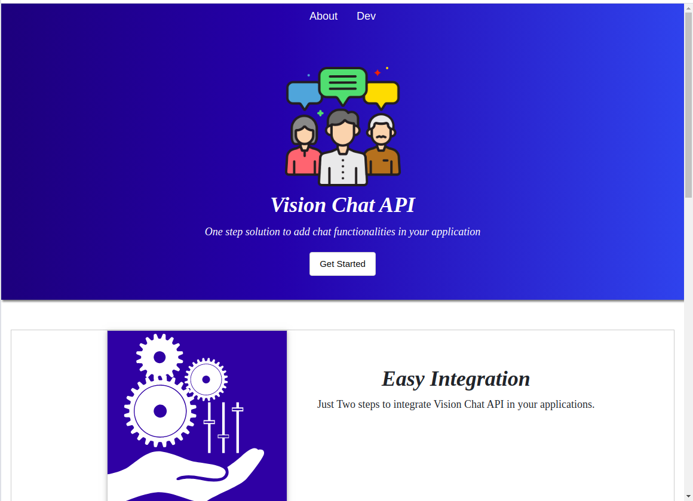
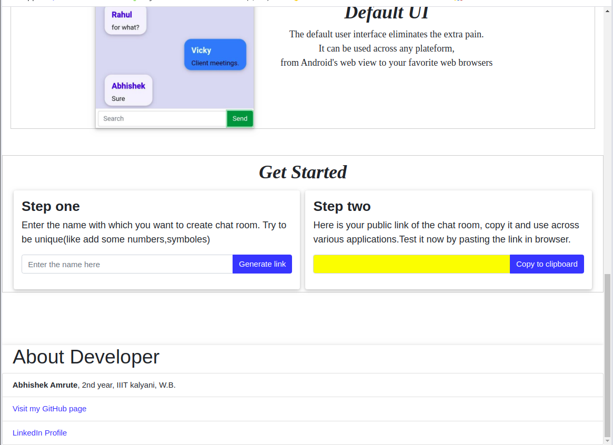
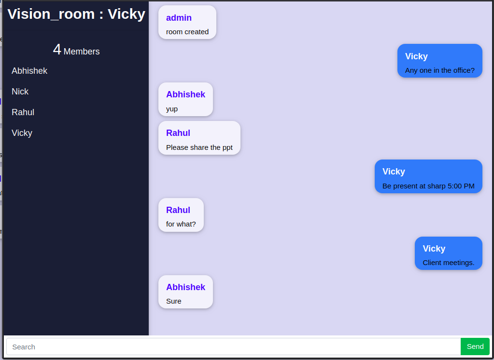
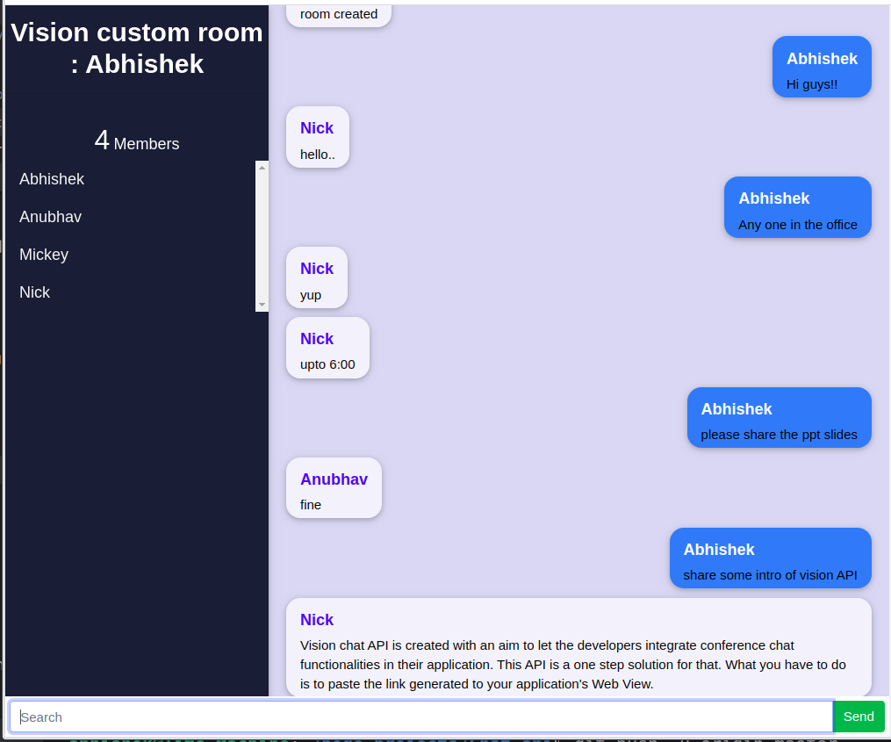
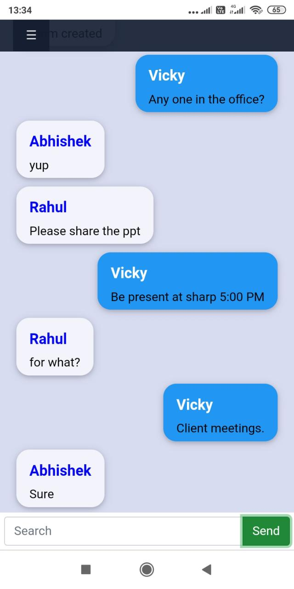

# Vision Chat API
[Visit Landing Page](https://vision-chat-api.herokuapp.com/)
Hi there! Vision chat API is created with an aim to let the developers integrate conference chat functionalities in their application. This API is a one step solution for that. What you have to do is to paste the link generated to your application's Web View.  
 
         
# Features

 1. Very easy to integrate.
 2. Data privacy and Automatic deletion : In order to maintain privacy, we promot functions to delete chat records after 24 hours(can be manipulated) of chat room creation.
 3. Default User interface eliminates pain. Use it across any platform. 
 
 

## How to integrate

 - Click the link [Vision chat API ](https://vision-chat-api.herokuapp.com/)and generate the link after providing room name for your chat room.
 - A link will be generated, copy that link and use accordingly. That's it! you are done with API integration.
 
 

 
## How to use generated link

|  Platform|where to use  |
|--|--|
| Android or IOS |In Web View with JavaScript enabled  |
|||
|Web Apps |Directly in Iframes or Browsers(As independent tabs) |

## Default User Interface

 

 

 

## Want to contribute

 1. Clone or download the repo.
 2. `npm init`
 3. [Link server](https://firebase.google.com/docs/database/web/start) and add configrations in Keys.js
 4. To run code  execute `npm run dev`

